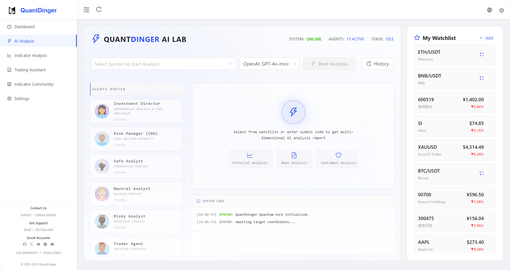

<div align="center">
  <a href="README.md">简体中文</a> |
  <a href="README_EN.md">English</a>
</div>

<div align="center">
  
  <h1>智弈量化桌面版</h1>
  <p><strong>ZhiYiQuant Desktop v2.2.0</strong></p>
  <p>基于 Tauri 2.x、Vue 2、Python Flask 和 SQLite 的本地优先 AI 量化交易桌面软件</p>
</div>

## 项目简介

ZhiYiQuant Desktop 是一套面向量化研究与交易执行的桌面应用软件，覆盖市场数据接入、指标分析、策略开发、回测验证、AI 分析、交易助手与持仓监控等完整流程。

当前仓库以桌面版为主，核心形态已经统一为：

- 桌面宿主：Tauri 2.x
- 前端界面：Vue 2 + Ant Design Vue
- 本地服务：Python Flask sidecar
- 本地数据：SQLite
- 目标版本：`v2.2.0`

## 当前版本重点

- 已完成 Tauri 2.x 桌面工程接入
- 已支持 Python sidecar 启动与本地端口联动
- 已支持桌面模式下默认使用 SQLite 本地数据库
- 已生成 Windows 安装包
- 已补齐软件著作权申报辅助材料

## 主要功能

- 可视化 Python 指标分析与策略开发
- 指标参数化、策略配置与回测
- AI 快速分析与历史记录
- 交易助手与策略运行控制
- 手动持仓管理与盈亏监控
- 多市场行情与基础面数据接入

## 仓库结构

```text
ZhiYiQuant/
├─ src-tauri/                    # Tauri 2.x 桌面工程
├─ quantdinger_vue/              # Vue 2 前端
├─ backend_api_python/           # Python Flask sidecar
├─ docs/                         # 项目文档
│  └─ software-copyright/        # 软著申报材料
└─ docker-compose.yml            # 兼容旧 Web/服务化部署
```

## 快速开始

### 1. 前端开发模式

```bash
cd quantdinger_vue
npm install
npm run serve
```

### 2. Tauri 桌面开发模式

```bash
cd src-tauri
cargo tauri dev
```

### 3. 构建桌面安装包

```bash
cd quantdinger_vue
npm run build

cd ../backend_api_python
python scripts/build_sidecar.py

cd ../src-tauri
cargo tauri build --bundles msi
```

## 产物位置

Windows 安装包默认输出到：

```text
src-tauri/target/release/bundle/msi/ZhiYiQuant_2.2.0_x64_en-US.msi
```

## 自动发布

仓库已经配置 GitHub Actions 自动发布流程：

- 分支日常构建：`.github/workflows/build-tauri.yml`
- GitHub Release 发布：`.github/workflows/publish-tauri.yml`

当你推送版本标签时，例如：

```bash
git tag v2.2.0
git push origin v2.2.0
```

GitHub Actions 会自动：

- 构建 Windows 安装包
- 构建 macOS 安装包
- 创建或更新对应版本的 GitHub Release
- 将安装包上传到 Release Assets

GitHub Releases 页面：

- <https://github.com/M-24rjgc/ZhiYiQuant/releases>

## 软件著作权材料

本仓库已经内置一套可直接整理申报的软件著作权辅助材料，入口见：

- [软著材料索引](docs/software-copyright/README_CN.md)
- [附件封面模板](docs/software-copyright/00_cover_template_cn.md)
- [申报附件包说明](docs/software-copyright/01_submission_packet_cn.md)
- [源码鉴别材料](docs/software-copyright/source_excerpt_v2.2.0.txt)

## 文档索引

- [Python 策略开发指南](docs/STRATEGY_DEV_GUIDE_CN.md)
- [IBKR 实盘交易指南](docs/IBKR_TRADING_GUIDE_CN.md)
- [MT5 外汇交易指南](docs/MT5_TRADING_GUIDE_CN.md)
- [后端说明](backend_api_python/README.md)
- [前端说明](quantdinger_vue/README.md)

## 项目截图

- 
- 
- 

## 许可证

本项目代码基于 [Apache 2.0](LICENSE) 开源。

品牌名称、Logo 与商业化再分发时的标识使用，请结合仓库内的 [TRADEMARKS.md](TRADEMARKS.md) 一并确认。
